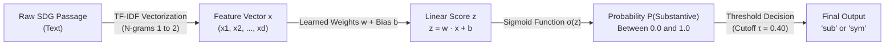

# Logistic Regression Methodology: Text-to-Construct Mapping & Reliability

This document outlines the theoretical, mathematical, and computational framework of how **Logistic Regression** models, trains, and predicts the relationship between corporate sustainability disclosure texts and disclosure substantiveness (**Symbolic** vs. **Substantive** / **Izhar et al. 2026 Depth Scale**).

---

## 1. Conceptual Architecture & Pipeline

---

## 2. Mathematical Formulation

### Step 1: High-Dimensional Text Representation (TF-IDF)
Raw text is projected into a normalized Euclidean vector space using **Term Frequency–Inverse Document Frequency (TF-IDF)** with sublinear scaling:

$$\text{TF-IDF}(t, d, D) = \left(1 + \ln(\text{TF}(t, d))\right) \times \ln\left(\frac{1 + |D|}{1 + \text{DF}(t, D)}\right)$$

Where:
- $\text{TF}(t, d)$ represents the frequency of term $t$ in passage $d$.
- $\text{DF}(t, D)$ represents the document frequency across the corpus $D$.
- $n$-grams ($n \in \{1, 2\}$) capture compound phrases (e.g., *"reduced by"*, *"verified by"*, *"code of conduct"*).

Each passage becomes a sparse vector:

$$\mathbf{x} = \begin{bmatrix} x_1 & x_2 & \dots & x_d \end{bmatrix}^T \in \mathbb{R}^d$$

---

### Step 2: Linear Log-Odds Scoring (Linguistic Evidence Aggregation)
The model computes a scalar evidence score $z$ via the dot product of the feature vector $\mathbf{x}$ and the learned coefficient vector $\mathbf{w}$, offset by an intercept $b$:

$$z = \mathbf{w}^T \mathbf{x} + b = \sum_{j=1}^d w_j x_j + b$$

* **Positive Weights ($w_j > 0$):** Indicators of **Substantive (`sub`)** disclosure:
  * $+w_{\text{'reduced by'}}$ $(+0.78)$, $+w_{\text{'tco2e'}}$ $(+0.65)$, $+w_{\text{'pwc'}}$ $(+0.82)$, $+w_{\text{'installed'}}$ $(+0.58)$
* **Negative Weights ($w_j < 0$):** Indicators of **Symbolic (`sym`)** disclosure:
  * $-w_{\text{'strive to'}}$ $(-0.61)$, $-w_{\text{'vision is'}}$ $(-0.54)$, $-w_{\text{'code of conduct'}}$ $(-0.48)$

The score $z$ reflects the net balance of empirical verifiable evidence versus aspirational policy language.

---

### Step 3: Probability Mapping via the Sigmoid Activation
The unbounded linear score $z \in (-\infty, +\infty)$ is transformed into a calibrated posterior probability $P(Y = \text{Substantive} \mid \mathbf{x}) \in [0, 1]$ via the standard logistic (sigmoid) function:

$$P(Y = 1 \mid \mathbf{x}) = \sigma(z) = \frac{1}{1 + e^{-z}} = \frac{1}{1 + e^{-(\mathbf{w}^T \mathbf{x} + b)}}$$

Correspondingly:

$$P(Y = 0 \mid \mathbf{x}) = 1 - \sigma(z) = \frac{e^{-z}}{1 + e^{-z}}$$

---

## 3. Training & Optimization (Maximum Likelihood Estimation)

During training on the **Human Ground Truth Dataset** $\{( \mathbf{x}_i, y_i )\}_{i=1}^N$ where $y_i \in \{0, 1\}$, the parameter vector $\mathbf{w}$ is estimated by minimizing the regularized **Binary Cross-Entropy Loss (Log-Loss)**:

$$\mathcal{L}(\mathbf{w}) = -\frac{1}{N} \sum_{i=1}^N \left[ y_i \ln(\hat{p}_i) + (1 - y_i) \ln(1 - \hat{p}_i) \right] + \frac{\lambda}{2} \|\mathbf{w}\|_2^2$$

Where:
- $\hat{p}_i = \sigma(\mathbf{w}^T \mathbf{x}_i + b)$ is the predicted substantive probability.
- $\frac{\lambda}{2} \|\mathbf{w}\|_2^2$ is the $L_2$ Ridge regularization penalty to prevent overfitting on sparse n-gram vocabularies.

### Optimization via L-BFGS
The gradient with respect to the weight vector is computed analytically:

$$\nabla_{\mathbf{w}} \mathcal{L} = \frac{1}{N} \sum_{i=1}^N (\hat{p}_i - y_i) \mathbf{x}_i + \lambda \mathbf{w}$$

The quasi-Newton **L-BFGS (Limited-memory Broyden–Fletcher–Goldfarb–Shanno)** optimization algorithm iteratively updates $\mathbf{w}$ until convergence.

---

## 4. Decision Rule & Inference

For any new unseen passage $\mathbf{x}_{\text{new}}$ across the 63,185 report passages:

$$\hat{y} = \begin{cases} \text{"sub"} & \text{if } P(Y=1 \mid \mathbf{x}_{\text{new}}) \ge \tau \\ \text{"sym"} & \text{if } P(Y=1 \mid \mathbf{x}_{\text{new}}) < \tau \end{cases}$$

*(Default threshold $\tau = 0.50$, tunable based on precision-recall trade-offs).*

---

## 5. Academic References & Grounding

1. **De Kok (2025)** — *"ChatGPT for Textual Analysis? How to Use Generative LLMs in Accounting Research"*, *Management Science*.
2. **Shah, K., Patel, H., Sanghvi, D., & Shah, M. (2020)** — *"A Comparative Analysis of Logistic Regression, Random Forest and KNN Models for Text Classification"*, *Augmented Human Research*.
3. **Izhar et al. (2026)** — *"Exploring firm-level SDG engagement in an emerging economy through content analysis"*, *Discover Sustainability*.
4. **Ashforth, B. E., & Gibbs, B. W. (1990)** — *"The Double-Edge of Organizational Legitimation"*, *Organization Science*.
