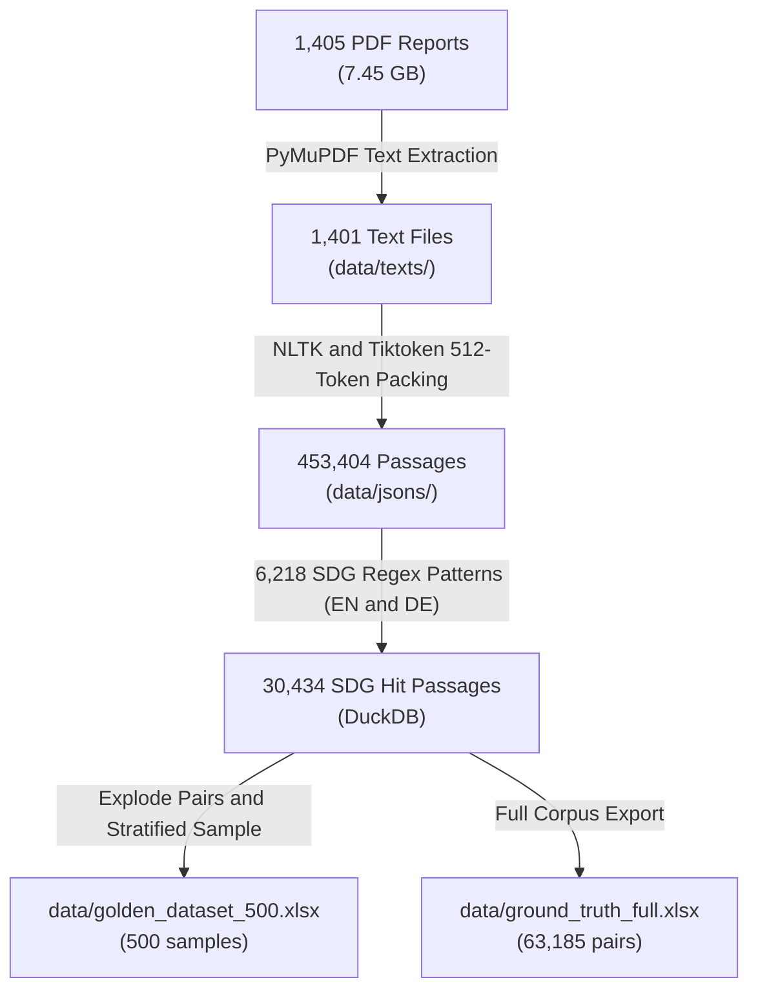

## 🏆 Golden Datasets for Human Evaluation & AI Reliability

Grounded in **De Kok (2025, Management Science)** and **Shah et al. (2020)**:

| File | Size | Role | Description |
|---|---|---|---|
| [data/golden_dataset_500.xlsx](file:///c:/Users/amanr/Documents/GitHub/Reliability%20test%20German/data/golden_dataset_500.xlsx) | 500 rows | **Standard Golden Dataset** | Recommended sample size per De Kok (2025). Balanced across all 17 SDGs. |
| [data/golden_dataset_1000.xlsx](file:///c:/Users/amanr/Documents/GitHub/Reliability%20test%20German/data/golden_dataset_1000.xlsx) | 1,000 rows | **Extended Golden Dataset** | Extended sample for higher statistical power in ML cross-validation. |
| [data/human_coding_sheet_500.xlsx](file:///c:/Users/amanr/Documents/GitHub/Reliability%20test%20German/data/human_coding_sheet_500.xlsx) | 500 rows | **Human Annotator Sheet** | Clean, focused sheet with instructions for Coder 1 & Coder 2. |
| [data/CODING_GUIDELINES.md](file:///c:/Users/amanr/Documents/GitHub/Reliability%20test%20German/data/CODING_GUIDELINES.md) | — | **Coding Rubric** | Standardized operational definitions for `sym` vs `sub` labels based on legitimacy theory. |
| [scripts/evaluate_reliability.py](file:///c:/Users/amanr/Documents/GitHub/Reliability%20test%20German/scripts/evaluate_reliability.py) | — | **Reliability Suite** | Automated evaluation suite: Cohen's Kappa, Logistic Regression, KNN, Random Forest, F1, and Type I/II errors. |

| File | Format | Rows | Description |
|---|---|---|---|
| [data/ground_truth.xlsx](file:///c:/Users/amanr/Documents/GitHub/Reliability%20test%20German/data/ground_truth.xlsx) | Excel | 1,000 | **Primary Ground Truth Dataset** for human evaluation. Stratified across all 17 SDGs. Format: `[passage, keyword, ground_truth]`. |
| [data/ground_truth.csv](file:///c:/Users/amanr/Documents/GitHub/Reliability%20test%20German/data/ground_truth.csv) | CSV | 1,000 | CSV version of the 1,000-sample ground truth dataset (UTF-8 with BOM). |
| [data/ground_truth_full.xlsx](file:///c:/Users/amanr/Documents/GitHub/Reliability%20test%20German/data/ground_truth_full.xlsx) | Excel | 63,185 | Complete dataset of all matched (passage, keyword) pairs with metadata (`company`, `year`, `language`, `sdg_category`, `global_id`). |
| [data/ground_truth_full.csv](file:///c:/Users/amanr/Documents/GitHub/Reliability%20test%20German/data/ground_truth_full.csv) | CSV | 63,185 | CSV version of the complete 63,185 pairs dataset. |
| [data/dbs/sdg_hits.duckdb](file:///c:/Users/amanr/Documents/GitHub/Reliability%20test%20German/data/dbs/sdg_hits.duckdb) | DuckDB | 30,434 | Native DuckDB database compatible with the AI-For-Sustainability repository classification pipeline. |

---

## 📈 Pipeline Summary & Statistics

### Key Metrics
- **Reports Processed:** 1,401 / 1,405 reports (149 companies, years 2014–2024)
- **Total Semantic Passages Generated:** 453,404 passages
- **SDG Hit Passages Found:** 30,434 passages
- **Exploded `(passage, keyword)` Pairs:** 63,185 pairs
- **SDG Representation:** All 17 SDGs covered

---

## 📊 SDG Hit Distribution Breakdown

| Category | Total Matches in Corpus | 1,000-Sample Allocation |
|---|---|---|
| **SDG 1 — No Poverty** | 131 | 58 |
| **SDG 2 — Zero Hunger** | 325 | 58 |
| **SDG 3 — Good Health & Well-being** | 82 | 58 |
| **SDG 4 — Quality Education** | 225 | 58 |
| **SDG 5 — Gender Equality** | 344 | 58 |
| **SDG 6 — Clean Water & Sanitation** | 1,319 | 58 |
| **SDG 7 — Affordable & Clean Energy** | 2,359 | 58 |
| **SDG 8 — Decent Work & Economic Growth** | 7,564 | 58 |
| **SDG 9 — Industry, Innovation & Infrastructure** | 3,759 | 58 |
| **SDG 10 — Reduced Inequalities** | 1,091 | 58 |
| **SDG 11 — Sustainable Cities & Communities** | 1,305 | 58 |
| **SDG 12 — Responsible Consumption & Production** | 14,024 | 58 |
| **SDG 13 — Climate Action** | 20,104 | 58 |
| **SDG 14 — Life Below Water** | 205 | 58 |
| **SDG 15 — Life on Land** | 159 | 58 |
| **SDG 16 — Peace, Justice & Strong Institutions** | 6,911 | 58 |
| **SDG 17 — Partnerships for the Goals** | 3,278 | 58 |
| **Remainder / Proportional Top-Up** | — | 14 |
| **Total** | **63,185** | **1,000** |

---

## 🛠️ Reproducible Scripts Created

- [scripts/extract_text.py](file:///c:/Users/amanr/Documents/GitHub/Reliability%20test%20German/scripts/extract_text.py) — Multi-worker PyMuPDF text extractor.
- [scripts/split_passages.py](file:///c:/Users/amanr/Documents/GitHub/Reliability%20test%20German/scripts/split_passages.py) — NLTK sentence tokenization + 512-token tiktoken greedy chunker.
- [scripts/sdg_keyword_match.py](file:///c:/Users/amanr/Documents/GitHub/Reliability%20test%20German/scripts/sdg_keyword_match.py) — Dual English/German SDG regex matcher writing to DuckDB.
- [scripts/generate_ground_truth.py](file:///c:/Users/amanr/Documents/GitHub/Reliability%20test%20German/scripts/generate_ground_truth.py) — Stratified sampler & Excel/CSV exporter.
- [scripts/run_sdg_pipeline.py](file:///c:/Users/amanr/Documents/GitHub/Reliability%20test%20German/scripts/run_sdg_pipeline.py) — Master orchestrator for the entire pipeline.
